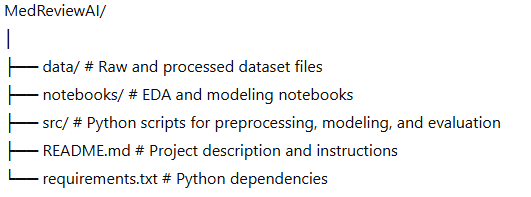

# 🏥 MedReviewAI: Predicting Independent Medical Review Outcomes

**Leveraging NLP and Machine Learning to Analyze Medical Appeal Text**

---

## 📘 Project Overview

In the U.S. healthcare system, an **Independent Medical Review (IMR)** allows patients to challenge denied medical services. Denials are typically based on claims that the service is **not medically necessary, experimental/investigational, or non-urgent**.

**MedReviewAI** is a comprehensive machine learning pipeline that analyzes the textual **Findings** from these reviews to predict whether an initial denial will be **Upheld** (denial stands) or **Overturned** (service approved). This project provides clinical auditors with an **Explainable AI (XAI)** tool to pre-screen appeals and understand the clinical logic driving the prediction.

### **Key Architectural Zones (Scope):**

1. **Zone 1: Data Input:** Ingests raw unstructured clinical text (Findings) and structured metadata (Diagnosis, Treatment, Age, Gender).
2. **Zone 2: Transformation:** Implements a core **Clinical Negation Handling** pipeline (e.g., converting "no fever" to `not_fever`), which is vital for preserving medical context.
3. **Zone 3: Feature Engineering:** Assembles a dual-branch feature matrix, combining **ClinicalBERT Embeddings** for text and One-Hot Encoded categorical data.
4. **Zone 4: Modeling Engine:** Compares a Baseline model (Random Forest) with a State-of-the-Art **Fine-Tuned ClinicalBERT** transformer to maximize the F1-score.
5. **Zone 5: Insight & Impact:** Moves beyond accuracy to provide **Explainable AI (LIME/SHAP)**, turning a "Black Box" model into a transparent clinical decision support tool.


---

## 🎯 Project Objectives

* **Text Analysis:** Extract features from complex clinical notes using advanced NLP techniques, including TF-IDF, word embeddings, and specialized Transformers.
* **Predictive Modeling:** Build a robust classifier to predict `Determination` outcomes accurately.
* **Multi-Modal Features:** Combine unstructured text with structured metadata (Diagnosis Category, Age, Gender) for enhanced predictive power.
* **Explainability:** Identify key clinical words and patterns that influence overturn decisions to provide actionable insights for stakeholders.

---

## 🛠️ Technical Stack

* **Languages:** Python
* **Data Handling:** pandas, numpy
* **Visualization:** matplotlib, seaborn, wordcloud
* **NLP & Text Processing:** NLTK, spaCy, scispaCy, Transformers (BERT/ClinicalBERT)
* **Modeling:** scikit-learn, XGBoost, PyTorch, HuggingFace Transformers
* **Explainability:** SHAP, ELI5

---

## 🚀 Workflow / Steps

1. **Data Loading & Exploration** – Inspect dataset structure, manage missing values, and analyze class distribution.
2. **Exploratory Data Analysis (EDA)** – Visualize trends and correlations by diagnosis, treatment, age, and gender.
3. **Text Preprocessing** – Implement advanced cleaning, lemmatization, stopword removal, and specialized negation handling.
4. **Feature Engineering** – Develop multi-modal features using TF-IDF, embeddings, and structured encoding techniques.
5. **Modeling** – Train and optimize baseline models (Logistic Regression, Random Forest) and advanced transformer-based NLP models.
6. **Evaluation** – Assess performance using Accuracy, **F1-score**, precision, recall, confusion matrix, and ROC-AUC.
7. **Explainability & Insights** – Leverage LIME/SHAP to highlight key clinical words influencing overturned decisions, turning the "Black Box" into a transparent tool.

---

## 📊 Dataset

* **Source:** California Department of Managed Health Care (DMHC) – Independent Medical Review (IMR) determinations
* **Target Variable:** `Determination` (Upheld / Overturned)
* **Primary Feature:** `Findings` (free-text notes from medical reviewers)
* **Additional Features:** `Diagnosis Category`, `Treatment Category`, `Age Range`, `Patient Gender`

---

## 💡 Potential Applications

* Accelerating and streamlining the healthcare claim review process.
* Supporting evidence-based healthcare policy analysis.
* Providing interpretable, data-driven insights for clinical decision-making.

---

## 📂 Repository Structure



---

## 🔗 References

* [California DMHC – Independent Medical Reviews](https://www.dmhc.ca.gov)
* [HuggingFace Transformers Documentation](https://huggingface.co/docs/transformers/index)
* [SHAP Explainability for Machine Learning](https://shap.readthedocs.io/en/latest/)

---

## ⚙️ Installation & Setup

To run this project locally, follow these steps to set up your environment:

1. **Create and activate a virtual environment:**
```bash
# Create virtual environment named .venv (hidden folder)
python -m venv nlp_env

# Activate it
# Windows
source nlp_env/Scripts/activate

```


2. **Install dependencies:**
```bash
# Upgrade pip first (good practice)
python -m pip install --upgrade pip setuptools wheel

# Install all packages from the requirements.txt file
pip install -r requirements.txt

# Install numpy with specific options
pip install numpy --only-binary :all: --no-cache-dir

# Install specific HuggingFace datasets library
pip install datasets

# Install transformers with PyTorch support
%pip install transformers[torch] --quiet

```


### **Required Packages (`requirements.txt`)**

* **Data manipulation:** pandas, numpy
* **Data visualization:** matplotlib, seaborn, wordcloud
* **Machine Learning / NLP:** scikit-learn, nltk, transformers, datasets, accelerate
* **Deep learning:** torch, torchvision, torchaudio
* **Kaggle helper:** kagglehub

---

## 📞 Contact

**Eric Maniraguha**

* Email: 
* LinkedIn: [linkedin.com/in/ericmaniraguha](https://www.linkedin.com/in/ericmaniraguha)


