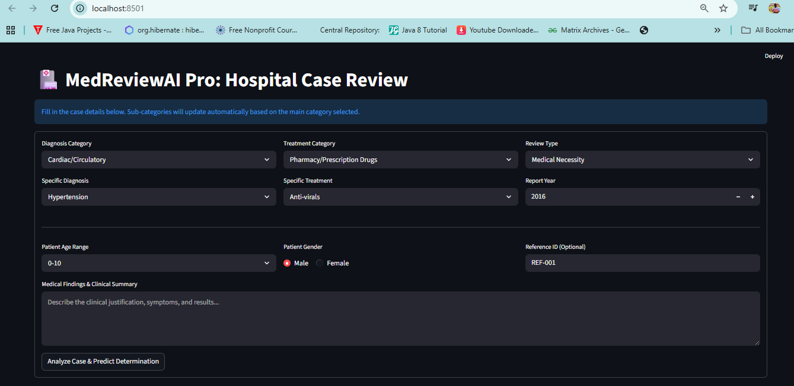
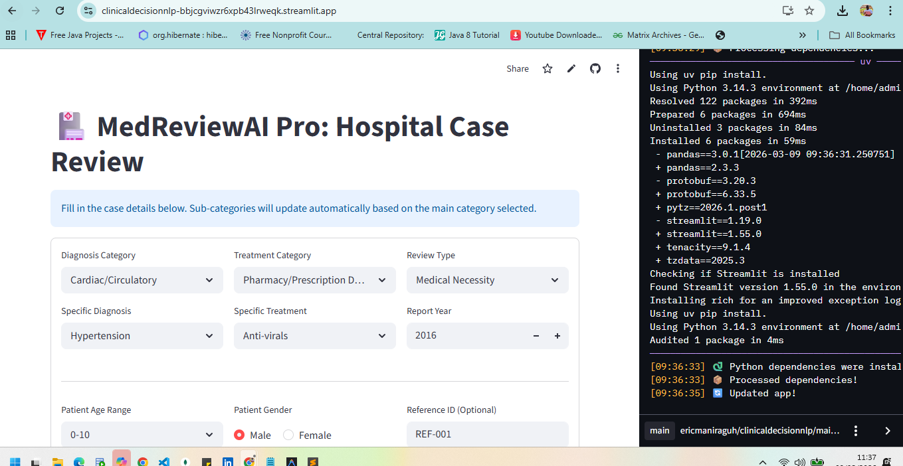
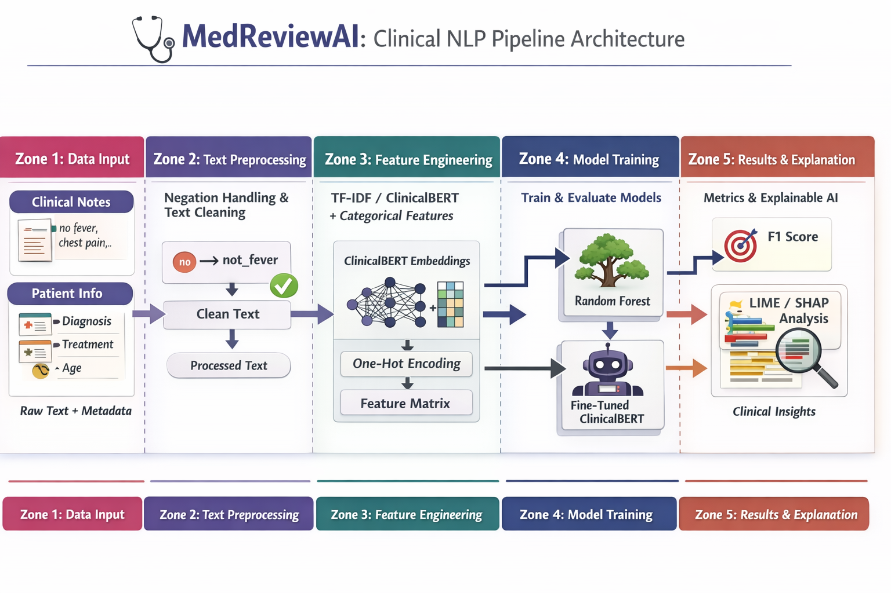

---

# MedReviewAI: Predicting Independent Medical Review Outcomes


**Leverage NLP and Machine Learning to Analyze Medical Appeal Text**

---

## 🌐 Deployed Application

Try the live app here: **[MedReviewAI on Streamlit](https://clinicaldecisionnlp.streamlit.app)**

**Features:**

* Input clinical case notes
* Predict if the initial denial will be **Upheld** or **Overturned**
* Explore explainable insights with LIME/SHAP




---

## Table of Contents

* [Project Overview](#project-overview)
* [Objectives](#objectives)
* [Technical Stack](#technical-stack)
* [Workflow](#workflow)
* [Dataset](#dataset)
* [Repository Structure](#repository-structure)
* [Installation & Setup](#installation--setup)
* [Running the Application](#running-the-application)
* [Running Tests](#-running-tests)
* [Potential Applications](#potential-applications)
* [References](#references)
* [Contact](#contact)

---

## Project Overview

In the U.S., an **Independent Medical Review (IMR)** allows patients to challenge denied medical services. Denials are often based on claims that services are **not medically necessary, experimental, or non-urgent**.

**MedReviewAI** analyzes textual **Findings** from IMRs to predict whether a denial will be **Upheld** or **Overturned**, providing **explainable AI (XAI)** insights for clinical auditors.

### Key Components

* **Zone 1: Data Input:** Unstructured text (`Findings`) + structured metadata (`Diagnosis`, `Treatment`, `Age`, `Gender`)
* **Zone 2: Transformation:** Handles clinical negations (e.g., “no fever” → `not_fever`)
* **Zone 3: Feature Engineering:** Combines ClinicalBERT embeddings with one-hot encoded categorical features
* **Zone 4: Modeling Engine:** Baseline Random Forest vs. fine-tuned ClinicalBERT transformer
* **Zone 5: Insights & Explainability:** Uses LIME/SHAP for interpretable predictions

### Architecture


*High-level NLP architecture for MedReviewAI*


*Detailed multi-modal processing pipeline*

---

## Objectives

* **Text Analysis:** Extract features from clinical notes using NLP (TF-IDF, embeddings, ClinicalBERT)
* **Predictive Modeling:** Classify `Determination` outcomes (Upheld / Overturned)
* **Multi-Modal Features:** Combine unstructured text with structured metadata
* **Explainability:** Identify key clinical words and patterns influencing overturned decisions

---

## Technical Stack

| Layer                     | Tools & Libraries                                        |
| ------------------------- | -------------------------------------------------------- |
| **Languages**             | Python 3.10                                              |
| **Data Handling**         | pandas, numpy                                            |
| **Visualization**         | matplotlib, seaborn, wordcloud                           |
| **NLP & Text Processing** | NLTK, spaCy, scispaCy, Transformers (BERT/ClinicalBERT)  |
| **Modeling**              | scikit-learn, XGBoost, PyTorch, HuggingFace Transformers |
| **Explainability**        | SHAP, ELI5                                               |
| **Web App**               | FastAPI, Streamlit                                       |

---

## Workflow

1. **Data Loading & Exploration** – Inspect dataset, handle missing values, analyze class distribution
2. **Exploratory Data Analysis (EDA)** – Visualize trends by diagnosis, treatment, age, gender
3. **Text Preprocessing** – Clean text, lemmatize, remove stopwords, handle negations
4. **Feature Engineering** – Create multi-modal features: TF-IDF, embeddings, categorical encoding
5. **Modeling** – Train baseline models and transformer-based NLP models
6. **Evaluation** – Accuracy, F1-score, Precision, Recall, Confusion Matrix, ROC-AUC
7. **Explainability** – Use LIME/SHAP to highlight influential clinical terms

---

## Dataset

* **Source:** [California DMHC – Independent Medical Reviews](https://www.dmhc.ca.gov)
* **Target Variable:** `Determination` (Upheld / Overturned)
* **Primary Feature:** `Findings` (clinical notes)
* **Additional Features:** `Diagnosis Category`, `Treatment Category`, `Age Range`, `Patient Gender`

---

## Repository Structure

```text
MedReviewAI/
├── data/
│   └── raw/
├── images/
│   ├── NLPArch_diagram.png
│   ├── NLP-Arch-Detailed.png
│   └── project_structure.png
├── models/
│   ├── clinicalbert_model/
│   ├── tfidf_vectorizer.pkl
│   └── random_forest_model.pkl
├── src/
│   ├── __init__.py
│   └── preprocessing.py
├── webapp/
│   ├── __init__.py
│   ├── app_api.py
│   └── app_ui.py
├── medreviewai-predicting-independent-medical-review.ipynb
├── tests/
├── requirements.txt
└── README.md
```

---

## Installation & Setup

```bash
# Create virtual environment
python -m venv nlp_env

# Activate
# Windows
nlp_env\Scripts\activate
# Linux / macOS
source nlp_env/bin/activate

# Upgrade pip
python -m pip install --upgrade pip setuptools wheel

# Install dependencies
pip install -r requirements.txt
```

Optional:

```bash
pip install numpy --only-binary :all: --no-cache-dir
pip install datasets
pip install transformers[torch]
```

---

## Running the Application

### 1️⃣ FastAPI Backend

```bash
.\nlp_env\Scripts\activate
uvicorn webapp.app_api:app --reload
# http://localhost:8000
```

### 2️⃣ Streamlit Frontend

```bash
.\nlp_env\Scripts\activate

p
# http://localhost:8501
```

---

## 🧪 Running Tests

Unit tests use **`unittest`**. Models and vectorizers are **mocked**, so real `.pkl` files aren’t needed.

```bash
# Activate environment
# Windows
nlp_env\Scripts\activate
# Linux / macOS
source nlp_env/bin/activate

# Install testing packages
pip install pytest requests fastapi

# Run tests
python -m unittest discover -s tests -p "*.py" -v
```

✅ Example output:

```text
..
----------------------------------------------------------------------
Ran 2 tests in 0.002s

OK
```

**Notes:**

* Mocked tests **don’t require actual model files**
* To test with real models, ensure paths in `app_api.py` exist:

```python
MODEL_PATH = os.path.join("..", "models", "random_forest_model.pkl")
VECTORIZER_PATH = os.path.join("..", "models", "tfidf_vectorizer.pkl")
```

* Include the same command in CI/CD workflows:

```yaml
- name: Run unit tests
  run: python -m unittest discover -s tests -p "*.py"
```

---


## Potential Applications

* Streamline healthcare claim review workflows
* Support data-driven healthcare policy decisions
* Provide interpretable insights for clinical decision support

---

## References

* [California DMHC – Independent Medical Reviews](https://www.dmhc.ca.gov)
* [HuggingFace Transformers Documentation](https://huggingface.co/docs/transformers/index)
* [SHAP Explainability for ML](https://shap.readthedocs.io/en/latest/)

---

## Contact

**Eric Maniraguha**

* LinkedIn: [linkedin.com/in/ericmaniraguha](https://www.linkedin.com/in/ericmaniraguha)

---
