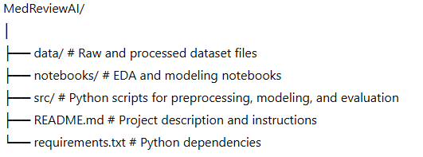

# MedReviewAI: Predicting Independent Medical Review Outcomes


**Leverage NLP and Machine Learning to Analyze Medical Appeal Text**

---

## Table of Contents

* [Project Overview](#project-overview)
* [Objectives](#objectives)
* [Technical Stack](#technical-stack)
* [Workflow](#workflow)
* [Dataset](#dataset)
* [Repository Structure](#repository-structure)
* [Installation & Setup](#installation--setup)
* [Running the Application](#running-the-application)
* [Potential Applications](#potential-applications)
* [References](#references)
* [Contact](#contact)

---

## Project Overview

In the U.S., an **Independent Medical Review (IMR)** allows patients to challenge denied medical services. Denials are often based on claims that services are **not medically necessary, experimental, or non-urgent**.

**MedReviewAI** is a machine learning pipeline designed to analyze textual **Findings** from IMRs to predict whether a denial will be **Upheld** or **Overturned**. The system provides **Explainable AI (XAI)** insights to help clinical auditors understand the reasoning behind predictions.

### Key Components

* **Zone 1: Data Input:** Unstructured text (`Findings`) + structured metadata (`Diagnosis`, `Treatment`, `Age`, `Gender`).
* **Zone 2: Transformation:** Handles clinical negations (e.g., “no fever” → `not_fever`).
* **Zone 3: Feature Engineering:** Combines ClinicalBERT embeddings for text and one-hot encoded categorical features.
* **Zone 4: Modeling Engine:** Baseline Random Forest vs. fine-tuned ClinicalBERT transformer.
* **Zone 5: Insights & Explainability:** Uses LIME/SHAP for interpretable predictions.

### Architecture


*Figure 1: High-level NLP architecture for MedReviewAI.*


*Figure 2: Detailed architecture showing multi-modal processing pipeline.*

---

## Objectives

* **Text Analysis:** Extract features from clinical notes using NLP (TF-IDF, embeddings, ClinicalBERT).
* **Predictive Modeling:** Accurately classify `Determination` outcomes (Upheld / Overturned).
* **Multi-Modal Features:** Combine unstructured text with structured metadata.
* **Explainability:** Identify key clinical words and patterns influencing overturned decisions.

---

## Technical Stack

| Layer                     | Tools & Libraries                                        |
| ------------------------- | -------------------------------------------------------- |
| **Languages**             | Python 3.10                                              |
| **Data Handling**         | pandas, numpy                                            |
| **Visualization**         | matplotlib, seaborn, wordcloud                           |
| **NLP & Text Processing** | NLTK, spaCy, scispaCy, Transformers (BERT/ClinicalBERT)  |
| **Modeling**              | scikit-learn, XGBoost, PyTorch, HuggingFace Transformers |
| **Explainability**        | SHAP, ELI5                                               |
| **Web App**               | FastAPI, Streamlit                                       |

---

## Workflow

1. **Data Loading & Exploration** – Inspect dataset, handle missing values, analyze class distribution.
2. **Exploratory Data Analysis (EDA)** – Visualize trends by diagnosis, treatment, age, gender.
3. **Text Preprocessing** – Clean text, lemmatize, remove stopwords, handle negations.
4. **Feature Engineering** – Create multi-modal features: TF-IDF, embeddings, categorical encoding.
5. **Modeling** – Train baseline models and advanced transformer-based NLP models.
6. **Evaluation** – Accuracy, F1-score, Precision, Recall, Confusion Matrix, ROC-AUC.
7. **Explainability** – Use LIME/SHAP to highlight influential clinical terms.

---

## Dataset

* **Source:** [California DMHC – Independent Medical Reviews](https://www.dmhc.ca.gov)
* **Target Variable:** `Determination` (Upheld / Overturned)
* **Primary Feature:** `Findings` (clinical notes)
* **Additional Features:** `Diagnosis Category`, `Treatment Category`, `Age Range`, `Patient Gender`

---

## Repository Structure

```text
MedReviewAI/
├── data/
│   └── raw/
├── images/
│   ├── NLPArch_diagram.png
│   ├── NLP-Arch-Detailed.png
│   └── project_structure.png
├── models/
│   ├── clinicalbert_model/
│   ├── tfidf_vectorizer.pkl
│   └── random_forest_model.pkl
├── src/
│   ├── __init__.py
│   └── preprocessing.py
├── webapp/
│   ├── __init__.py
│   ├── app_api.py       # FastAPI backend
│   └── app_ui.py        # Streamlit frontend
├── medreviewai-predicting-independent-medical-review.ipynb
├── requirements.txt
└── README.md
```



---

## Installation & Setup

1. **Create & Activate Virtual Environment**

```bash
# Create
python -m venv nlp_env

# Activate
# Windows
nlp_env\Scripts\activate
# Linux / macOS
source nlp_env/bin/activate
```

2. **Install Dependencies**

```bash
# Upgrade pip
python -m pip install --upgrade pip setuptools wheel

# Install packages
pip install -r requirements.txt

# Optional / additional
pip install numpy --only-binary :all: --no-cache-dir
pip install datasets
pip install transformers[torch]
```

---

## Running the Application

**Note:** Requires **two terminal windows**.

### 1️⃣ FastAPI Backend

```powershell
# Activate environment
.\nlp_env\Scripts\activate

# Start API server
uvicorn webapp.app_api:app --reload
# Runs at http://localhost:8000
```

### 2️⃣ Streamlit Frontend

```powershell
# Activate environment in a new terminal
.\nlp_env\Scripts\activate

# Start Streamlit app
streamlit run webapp\app_ui.py
```

You can now input clinical cases and get predictions with **explainable insights**.

- Open your browser at: `http://localhost:8501`


---

## Potential Applications

* Streamline healthcare claim review workflows
* Support data-driven healthcare policy decisions
* Provide interpretable insights for clinical decision support

---

## References

* [California DMHC – Independent Medical Reviews](https://www.dmhc.ca.gov)
* [HuggingFace Transformers Documentation](https://huggingface.co/docs/transformers/index)
* [SHAP Explainability for ML](https://shap.readthedocs.io/en/latest/)

---

## Contact

**Eric Maniraguha**

* LinkedIn: [linkedin.com/in/ericmaniraguha](https://www.linkedin.com/in/ericmaniraguha)

